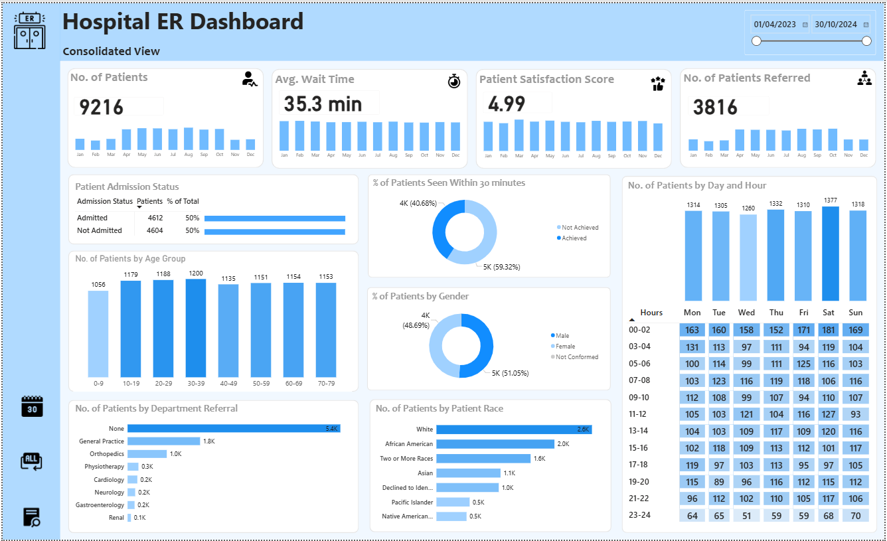
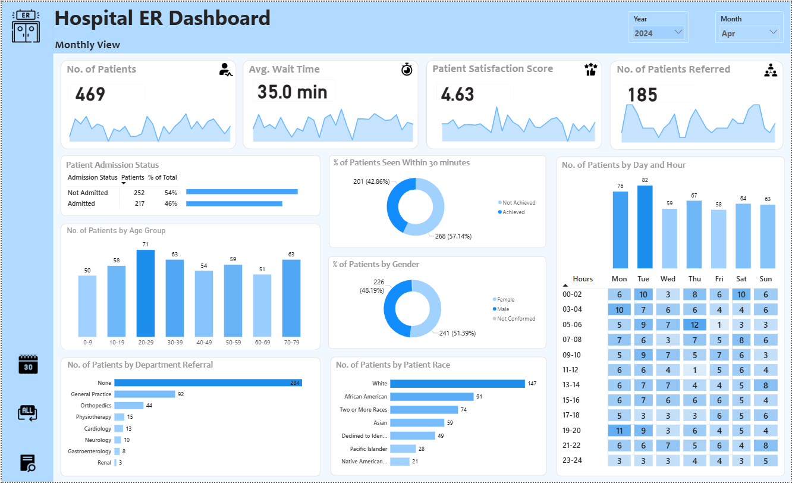
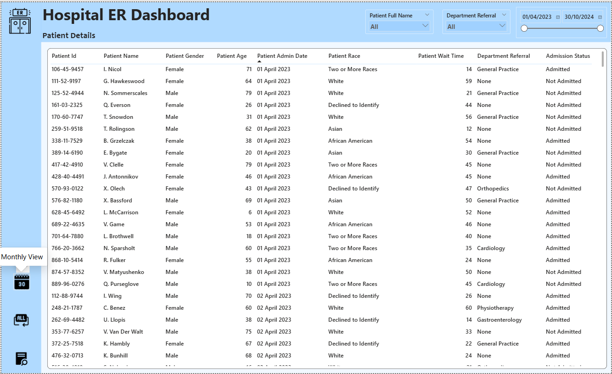
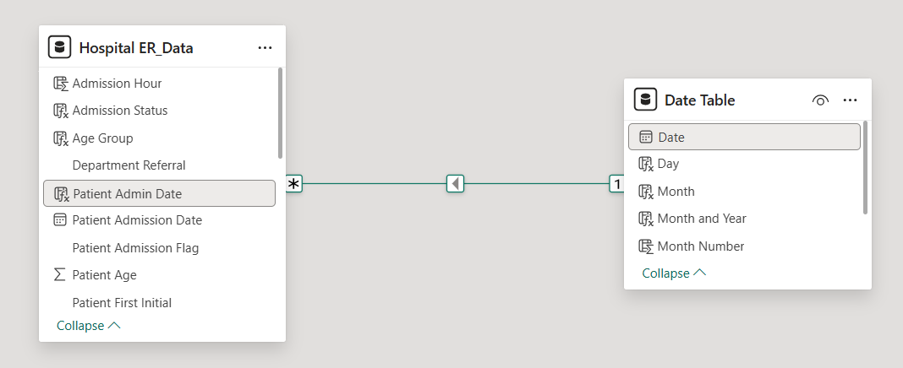

# Hospital Emergency Room Analysis Dashboard (Power BI)

## Overview

This project analyzes Emergency Room (ER) operations using an interactive Power BI dashboard built on 19 months of hospital data (April 2023 – October 2024).

The dashboard was designed to monitor operational performance, patient experience, referral patterns, and demographic trends through interactive reporting and drill-down analysis.

The report was designed across multiple dashboard pages to support both high-level monitoring and detailed patient exploration.

---

## Dashboard Features

### 1. Consolidated Dashboard
A high-level executive overview of hospital ER performance and patient trends.

Includes:
- KPI cards with embedded trend charts
- Time-range filtering using Between slicers
- Patient admission status analysis
- Wait-time performance monitoring
- Satisfaction score tracking
- Demographic analysis
- Referral analysis
- Patient traffic heatmaps
- Page navigation using icon-based navigation buttons with tooltips

---

### 2. Monthly Analysis Dashboard
Focused analysis for specific reporting periods.

Features:
- Dropdown slicers for Month and Year selection
- Monthly operational analysis
- Trend comparison across selected periods

---

### 3. Patient Details Dashboard
Detailed patient-level exploration.

Features:
- Grid/table view of patient records
- Between slicer for date filtering
- Department filtering
- Search-enabled patient lookup

---

## Dataset

The dataset contains hospital emergency room records covering **April 2023 to October 2024**.

### Fields included:

- Patient ID
- Patient Admission Date
- Patient First Initial
- Patient Last Name
- Patient Gender
- Patient Age
- Patient Race
- Department Referral
- Patient Admin Flag
- Patient Satisfaction Score
- Patient Wait Time
- Patients CM (Case Manager)

---

## Data Preparation & Modeling

Data transformation and modeling were performed in Power Query and Power BI before analysis and dashboard development.

- Validated data completeness and distribution using Power Query profiling tools  
- Cleaned and standardized data types and patient fields  
- Combined patient initials and surnames into full names for improved readability  
- Engineered analytical features including age groups, wait-time segments, and admission hour intervals  
- Built a Date dimension and established one-to-many relationships to support time intelligence and chronological analysis  
- Developed DAX measures and calculated columns for KPI reporting, trend analysis, and dynamic filtering

---

## Exploratory Analysis & Insights

### Patient Volume
- Total patients recorded: **9,216**
- Admission outcomes were nearly evenly distributed:
  - Admitted: **4,612**
  - Not admitted: **4,604**

---

### Operational Performance
- Average patient wait time was **35.3 minutes**, exceeding the operational target of **30 minutes**
- Only **40% of patients were attended to within 30 minutes**

This indicates opportunities to improve ER throughput and reduce waiting periods.

---

### Patient Experience
- Average patient satisfaction score: **4.99**
- Monday and Tuesday recorded comparatively lower satisfaction levels.
- Despite recording the highest patient volume, Saturday also achieved the highest satisfaction score (5.12), suggesting patient satisfaction may not be driven solely by traffic levels.

---

### Traffic Patterns
- Early hours (**00:00–02:00**) consistently showed the highest patient traffic across the week.
- Saturday was identified as the busiest day overall.

---

### Referral Analysis
- Total patients referred: **3,816**

Top referral departments:

1. General Practice (**1,840**)
2. Orthopaedics (**995**)

Additional observation:
- Renal referrals showed relatively low volume despite elevated average wait times (~34.7 minutes overall and ~38 minutes for admitted patients), suggesting referral count alone may not fully explain waiting performance.

---

### Demographics

#### Age Distribution
Largest patient groups:

- Age 30–39 → **1,200**
- Age 20–29 → **1,188**

Overall patient distribution remained relatively balanced across age ranges.

#### Race Distribution
Largest recorded groups:

- White → **2,571**
- African American → **1,951**

Additional note:
- **1,030 patients declined race disclosure**

---

## Tools & Skills

### Tools
- Power BI
- Power Query
- DAX

### Skills Demonstrated
- ETL & Data Transformation
- Data Modeling
- Dashboard Design
- KPI Development
- Exploratory Data Analysis
- Business Intelligence Reporting
- Data Storytelling

---

## Files

- `Hospital_ER_Analysis_Dashboard.pbix` — Power BI report
- `README.md` — Project documentation
- `screenshots/` — Dashboard screenshots

---

## Screenshots

### Consolidated Dashboard

### Monthly Dashboard

### Patient Details Dashboard

### Data Model Relationship

